# California Wildfire Modeling

## Research Question

Can wildfire risk in California be accurately predicted at a spatial grid cell level using historical environmental, geographic, and human activity data?

## Bottom Line Up Front

The model operates under significant class imbalance and shows modest PR-AUC, precision, and recall, indicating limited ability to fully separate fire from no fire events in absolute terms. However, all models perform substantially above baseline prevalence, demonstrating meaningful predictive signal beyond class imbalance. The results reveal strong and interpretable structure in the data, most notably a dominant temporal persistence effect through last month fire occurrence, alongside meaningful contributions from seasonality, vegetation state, human activity, and spatial location. Meteorological variables contribute comparatively little additional signal once these factors are included. The model also captures a clear seasonal pattern, with moderate elevation in spring and a pronounced peak in late year, consistent with known wildfire dynamics. Overall, despite constrained predictive performance, the results indicate that wildfire risk is primarily governed by persistent temporal and spatial structure, which the model is able to learn in a coherent and physically interpretable way.

## Data

### Sources

- [ERA5-Land monthly aggregation](https://developers.google.com/earth-engine/datasets/catalog/ECMWF_ERA5_LAND_MONTHLY_AGGR#bands)
- [MODIS MOD13A2](https://developers.google.com/earth-engine/datasets/catalog/MODIS_061_MOD13A2#bands)
- [SRTM (USGS)](https://developers.google.com/earth-engine/datasets/catalog/USGS_SRTMGL1_003)
- [GPWv411 (CIESIN)](https://developers.google.com/earth-engine/datasets/catalog/CIESIN_GPWv411_GPW_Population_Density)
- [VIRRS DNB Monthly](https://developers.google.com/earth-engine/datasets/catalog/NOAA_VIIRS_DNB_MONTHLY_V1_VCMSLCFG)
- [MODIS MOD14A1 FireMask](https://developers.google.com/earth-engine/datasets/catalog/MODIS_061_MOD14A1#description)

### Data Gathering

#### Spatial Aggregation

All features are first computed at their native or ~1 km resolution and then aggregated to ~5 km grid cells using mean reduction. As a result, feature values represent average conditions within each grid cell, while `fire` represents the proportion of sub-grid pixels with detected fire activity. Similarly, `fire_binary` represents whether fire was observed in the grid cell during the month.

#### Google Earth Engine

Earth Engine scripts were used to gather data into a tabular format from open source rasterized datasets. The scripts can be found in the `scripts` folder.

- [CaliforniaPoly.js](scripts/CaliforniaPoly.js)
- [DataAggregation.js](scripts/DataAggregation.js)

### Exploratory Data Analysis (EDA)

#### Target Variables

These features were captured in order to facilitate building models of either a classification or regression type. Classification was chosen for this analysis.

- `fire`
  - **Definition:** Monthly wildfire occurrence intensity
  - **Source:** MODIS MOD14A1 FireMask
  - **Construction:**
    - Daily fire detections thresholded (`FireMask ≥ 7`)
    - Monthly maximum indicating any fire occurrence
    - Spatial mean across grid cell
  - **Range:** 0 to 1
  - **Unit:** Proportion of 1 km pixels within the grid cell where fire was detected during the month
- `fire_binary`
  - **Definition:** Indicator of any fire occurrence within the grid cell during a given month
  - **Source:** MODIS MOD14A1 FireMask
  - **Construction:** `fire > 0`
  - **Unit:** Binary (0 or 1)

#### Feature Variables

This data was gathered from open source raster data freely available on Google Earth Engine, from the sources listed above.

**Weather / Climate**
- `temp`
  - **Definition:** Mean 2 meter air temperature
  - **Source:** ERA5-Land monthly aggregation `temperature_2m`
  - **Unit:** Degrees Celsius (°C)
- `precip`
  - **Definition:** Total monthly precipitation
  - **Source:** ERA5-Land monthly aggregation `total_precipitation_sum`
  - **Unit:** Millimeters (mm), converted from meters
- `wind`
  - **Definition:** Mean wind speed at 10 meters
  - **Source:** ERA5-Land monthly aggregation of easterly wind `u_component_of_wind_10m` and northerly wind `v_component_of_wind_10m`
  - **Construction:** \[ \sqrt{u^2 + v^2} \]
    - `u` = zonal wind component
    - `v` = meridional wind component  
  - **Unit:** Meters per second (m/s)
- `vpd`
  - **Definition:** Vapor Pressure Deficit, atmospheric moisture deficit (indicator of dryness)
  - **Derivation:** Air temperature (°C) and Dew Point temperature (°C) using a Tetens based saturation vapor pressure approximation
  - **Source:** ERA5-Land monthly aggregation of temperature `temperature_2m` and dew point temperature `dewpoint_temperature_2m`
  - **Unit:** Kilopascals (kPa)

**Vegetation**
- `ndvi`
  - **Definition:** Mean Normalized Difference Vegetation Index
  - **Source:** MODIS MOD13A2 `NDVI`
  - **Scaling:** Raw values multiplied by 0.0001
  - **Unit:** Unitless (typically ranges from −1 to 1)
  - **Interpretation:**
      - Negative values (-1 to 0): Usually correspond to water, snow, or non-vegetated surfaces like clouds or man made structures.
      - Near zero (0 to 0.1): Represent barren areas of rock, sand, or snow.
      - Low positive values (0.2 to 0.4): Represent shrub and grassland or stressed vegetation.
      - High positive values (0.6 to 0.9): Indicate healthy, dense vegetation canopy or temperate/tropical rainforests.
  
**Terrain**
- `elevation`
  - **Source:** SRTM (USGS)
  - **Unit:** Meters (m)
- `slope`
  - **Definition:** Terrain slope derived from elevation
  - **Unit:** Degrees (°)
  
**Human**
- `pop_density`
  - **Definition:** Population density (2020 snapshot)
  - **Source:** GPWv411 (CIESIN) `population_density`
  - **Aggregation:** Mean within grid cell
  - **Unit:** Persons per square kilometer (people/km²)
- `night_lights`
  - **Definition:** Average nighttime radiance
  - **Source:** VIIRS DNB Monthly `avg_rad`
  - **Unit:** nanowatts per square centimeter per steradian (nW/cm²/sr)
- `popLog`
  - **Definition:** Log transformed population density
  - **Formula:**  `log(pop_density + 1)`
  - **Unit:** Unitless
- `popLog_ndvi`
  - **Definition:** Engineered, interaction between vegetation and human presence
  - **Formula:** `ndvi *  log(pop_density + 1)`
  - **Unit:** Unitless
  
**Temporal**
- `fire_last_month`
  - **Definition:** Previous month's wildfire occurrence intensity
  - see `fire` target variable for more information
- `fire_last_month_binary`
  - **Definition:** Indicator of any fire occurrence within the grid cell last month
  - **Construction:** `fire_last_month > 0`
  - **Unit:** Binary (0 or 1)
  - **Description:** This feature reflects known temporal clustering in wildfire systems driven by fuel continuity, seasonal fire regimes, and lingering environmental conditions
- `precip_3month`
  - **Definition:** Rolling 3 month cumulative precipitation
  - **Unit:** Millimeters (mm)
- `ndvi_change`
  - **Definition:** Month over month change in NDVI
  - **Derivation:** Current month NDVI − previous month NDVI
  - **Unit:** NDVI difference
- `month`
  - **Definition:** Month of the year

#### Feature Distribution Analysis

To support feature diagnostics and early signal assessment, kernel density estimation (KDE) plots were used to compare feature distributions across the target classes. This enables direct visualization of how feature values differ between fire and no fire observations, particularly under extreme class imbalance. These comparisons help identify separability, skewness, and potential transformation needs prior to modeling, as well as highlight whether features exhibit meaningful class-conditioned structure or are dominated by noise.

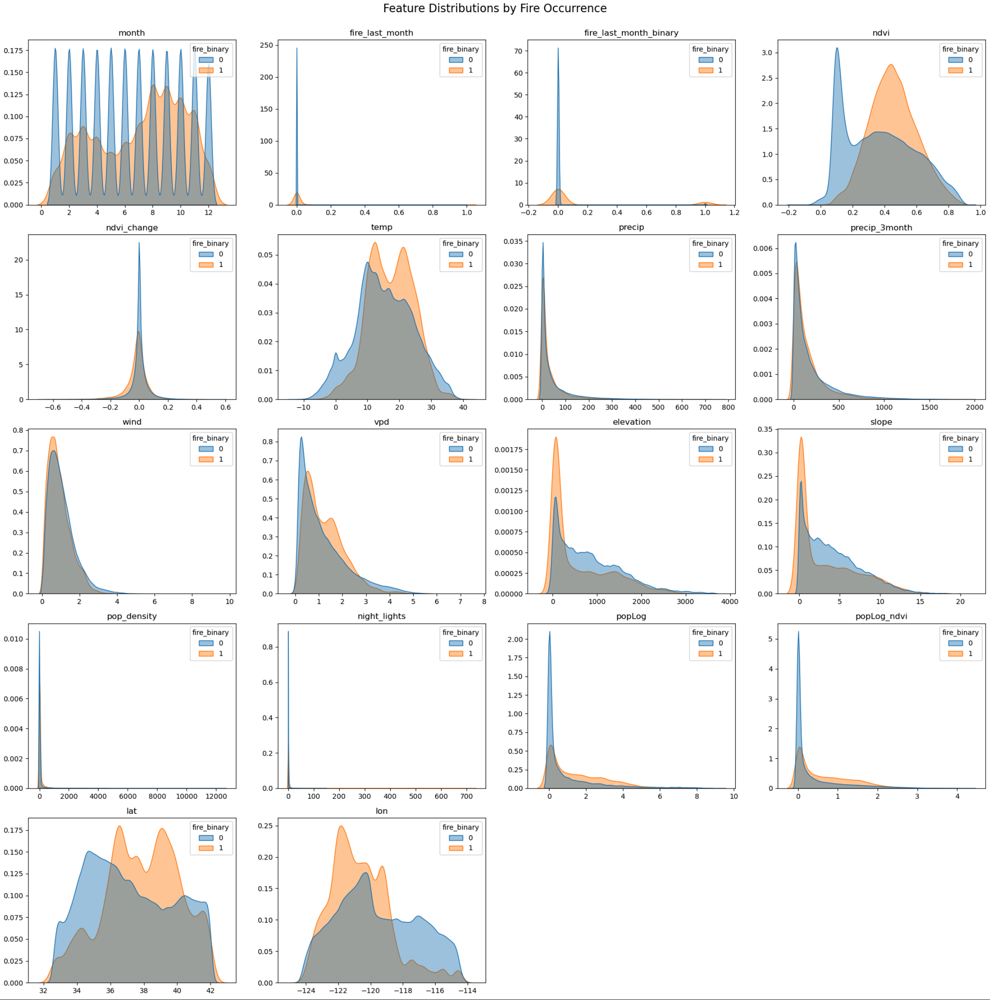

Kernel density plots reveal clear distributional differences between fire and no fire observations across several environmental variables, particularly vegetation index (NDVI) and vapor pressure deficit (VPD), indicating meaningful signal for predictive modeling.

#### Feature IQR Plot Analysis

Boxplot analysis identified the presence of outliers across several features, particularly environmental and topographical. These values were retained, as they likely represent extreme but realistic environmental conditions associated with wildfire events. The decision to retain outliers was also made due to the understanding that models chosen for assessment are robust to outliers in the training data, and that extreme values may be an indicator of fire.

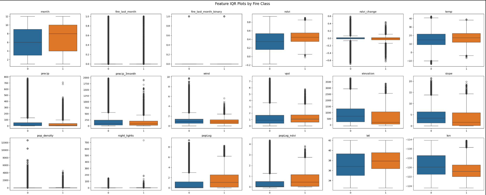

#### Feature Transformation

##### Skewness Adjustment

Outlier analysis revealed heavily right skewed distributions across several environmental variables, including precipitation, wind, vapor pressure deficit (VPD), and vegetation change metrics. Rather than removing extreme values, log transformations (log1p) were applied to reduce skewness while preserving physically meaningful extremes associated with wildfire conditions.

##### Cyclical Month Representation

The month variable is transformed using cyclical encoding via sine and cosine functions to properly represent the periodic nature of seasonal effects. Unlike ordinal or one-hot encoding, cyclical transformation preserves the continuity between December and January, ensuring that seasonal proximity is accurately reflected in feature space. This is particularly important in environmental systems such as wildfire risk modeling, where climate conditions vary smoothly and cyclically throughout the year rather than abruptly resetting at calendar boundaries.

## Principal Component Analysis (PCA)

Principal Component Analysis (PCA) was used to study the possibility of dimensionality reduction and to capture the dominant variance structure across correlated environmental variables. Given the presence of multicollinearity among climate and vegetation features (e.g., precipitation, NDVI, and vapor pressure deficit), PCA can help reduce redundancy while preserving the majority of explanatory signal.

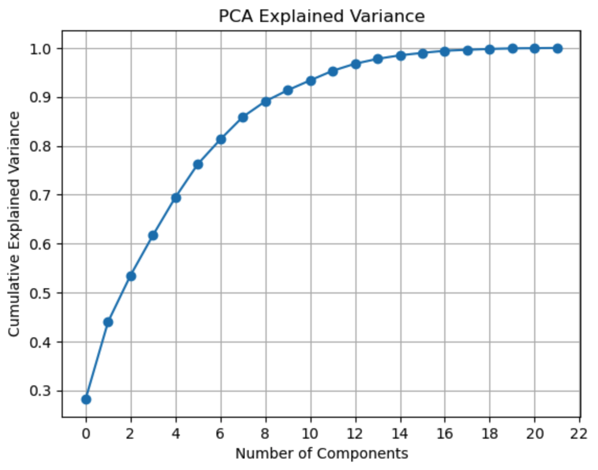

Principal Component Analysis shows that approximately 95% of the variance is explained by 11 components, suggesting that while some correlated feature groups exist, most variables contribute distinct information. This indicates moderate, but not severe, multicollinearity.

### Feature Correlation

Correlation analysis revealed strong correlation among derived and related variables. Temperature and vapor pressure deficit (VPD) showed a correlation of 0.9 due to shared physical relationships. Similarly, population density and night lights were highly correlated. An engineered interaction term (log population × NDVI) was noted to be highly correlated to log population, a feature from which it was engineered. Precipitation and its 3 month rolling sum were moderately correlated but retained due to their representation of short and long term environmental conditions.

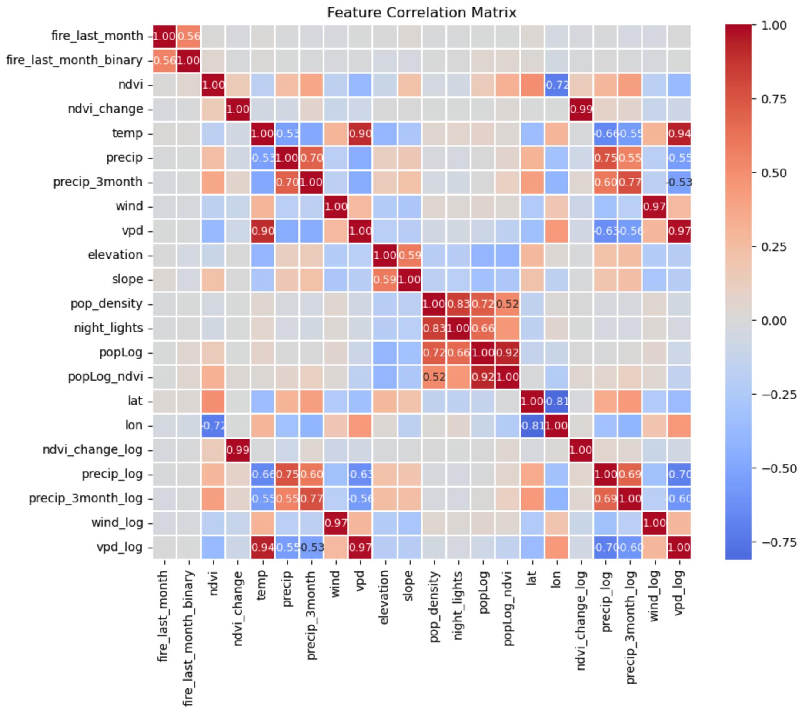

Given usage of tree based ensemble methods, these highly correlated features were retained, as these models are highly resilient to correlated features. Additionally, these features may carry signal in a signal sparse environment.

## Data Preparation

### Training and Testing Splits

To evaluate model robustness under different real world generalization challenges, structured data masks were created to generate distinct train–test splits based on temporal, spatial, and combined spatiotemporal constraints. These splits simulate different deployment paradigms: forecasting across time, generalizing across geographic space, and jointly handling both shifts simultaneously. This framework enables systematic comparison of model performance under varying distribution shift conditions, reflecting the distinct challenges inherent in wildfire prediction across time and location.

## Modeling

### Modeling Workflow

The modeling workflow consists of two stages: (1) baseline evaluation of four candidate models under default configurations across all train/test splits, and (2) hyperparameter optimization of the top performing model identified in stage one. This approach ensures consistent model comparison while enabling focused performance refinement of the most promising architecture.

Dynamic class weighting was used throughout modeling to correct for strong class imbalance, ensuring that rare fire events were appropriately emphasized during training and reducing bias toward majority no fire predictions.

### Modeling Approach & Selection

Wildfire occurrence was formulated as a binary classification problem, where each spatial temporal observation is labeled as fire or no fire. This framing aligns with the operational goal of identifying areas at elevated risk, rather than predicting exact fire intensity or spread. Classification models are well suited to this task, particularly under severe class imbalance, as they allow flexible thresholding to balance precision and recall based on application needs. Four model families were selected to represent a range of modeling assumptions and complexity:

- Logistic regression as a linear baseline
- Random forest as a bagging based ensemble capturing nonlinear relationships
- Gradient boosting methods to model complex interactions and optimize predictive performance on structured tabular data
  - LightGBM
  - XGBoost

Together, these models provide a spectrum from interpretable baseline to high performance learners, enabling both benchmarking and robust comparison.

### Modeling Assessment

#### Primary Decision Metric

Due to the extreme class imbalance in wildfire occurrence, precision–recall AUC (PR-AUC) was selected as the primary evaluation metric. While recall measures the proportion of true fire events detected, it does not account for the rate of false positives and can be trivially maximized by predicting all observations as fires. PR-AUC instead evaluates model performance across the full range of decision thresholds, capturing the trade off between precision and recall. This provides a more informative assessment of model utility in imbalanced settings, where both detecting rare fire events and limiting false alarms are critical.

Because wildfire occurrence is highly imbalanced, the baseline PR-AUC is approximately equal to the positive class prevalence (~1%). This provides a reference point for evaluating model skill, as improvements above this baseline indicate meaningful predictive signal beyond random or naive classification.

### Modeling Execution

#### Four Model Default Performance Findings

Across all evaluation regimes (temporal, spatial, and spatiotemporal), ensemble tree based methods significantly outperform linear baselines, confirming strong nonlinear structure in wildfire risk drivers.

XGBoost achieves the highest PR-AUC under the most realistic spatiotemporal holdout, indicating superior generalization to unseen geographic regions and future time periods. LightGBM also performs well, particularly when focusing on recall.

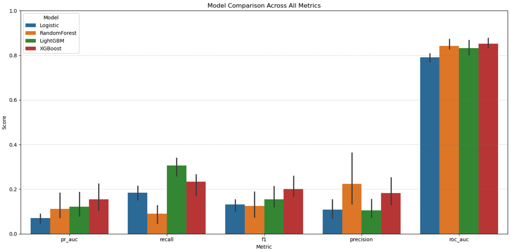

For each split, its corresponding radar chart and heatmap shows clearly the performance of XGBoost over competing models, particularly when assessing the primary metric PR-AUC.

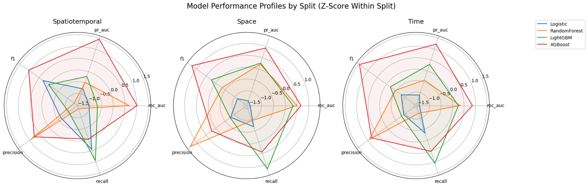

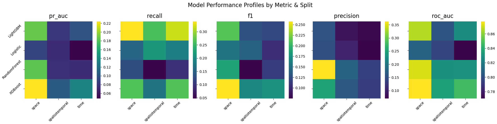

Radar charts were used for qualitative comparison of model performance profiles. However, due to differences in metric scale and distribution, radar visualizations should be interpreted as relative shape comparisons rather than absolute performance rankings.

#### Single Model Hyperparameter Optimization

XGBoost was the top performing model among the initial four models, as determined by the PR-AUC metric as well as strong performance in other metrics assessed.

In order to maximize the capability of this model, an incremental RandomizedSearchCV process was created. Three sets of parameter grids were built to optimize the performance of the XGBoost model.

The first two parameter grids tested the structural preference of the model. Structural hyperparameters converged across spatial regimes, indicating a stable nonlinear representation of wildfire risk. Remaining variability is primarily due to stochastic regularization parameters controlling robustness under class imbalance.

Structural hyperparameters chosen:

- `subsample`: 0.8
- `n_estimators`: 600
- `max_depth`: 12
- `learning_rate`: 0.125
- `colsample_bytree`: 0.95

The selected structural hyperparameters indicate a model that favors relatively deep, expressive trees (`max_depth` = 12) combined with a moderate learning rate (0.125) and a large number of boosting rounds (`n_estimators` = 600), suggesting the signal in the data benefits from iterative refinement rather than shallow or highly regularized learning. The consistently high `subsample` (0.8) and `colsample_bytree` (0.95) values imply that the model performs best with minimal but meaningful stochastic regularization, preserving most of the feature space and data while still introducing enough randomness to reduce overfitting. Overall, this configuration points to a setting where predictive performance is driven by complex feature interactions and high model capacity, rather than strong regularization or simplified structure.

Next, a single optimization was performed against a parameter grid focusing on class imbalance. Imbalance hyperparameters chosen:

- `scale_pos_weight`: 50
- `reg_lambda`: 10
- `reg_alpha`: 0
- `min_child_weight`: 2
- `gamma`: 0.05

The final imbalance tuned configuration shows strong convergence on a stable set of regularization and class-balancing parameters across all splits, most notably a consistently high `scale_pos_weight` of 50, indicating that class imbalance is a dominant and persistent constraint in the dataset regardless of spatial or temporal partitioning. The selected `reg_lambda` of 10 with `reg_alpha` at 0 suggests that L2 regularization alone is sufficient to control model complexity, while L1 sparsity is not beneficial for this problem. The moderate `min_child_weight` (2) and small but non-zero `gamma` (0.05) indicate a slightly more conservative split strategy than a fully unconstrained tree, providing limited regularization at the node level while still allowing the model to capture weak but meaningful minority class structure. Overall, this configuration reflects a scenario where performance is primarily governed by robust class imbalance correction, with only mild additional constraints needed to stabilize tree growth.

### Final Model Assessment

The results show a clear performance hierarchy across the three spatial-temporal modeling strategies, with the spatial split consistently outperforming the others, particularly in PR-AUC (0.244) and precision (0.334), indicating it is best at identifying true fire events while maintaining meaningful predictive signal under severe class imbalance. The temporal model performs moderately across all metrics, suggesting it captures general temporal patterns but lacks the spatial specificity needed for stronger discrimination. In contrast, the spatiotemporal split shows the weakest performance across nearly all metrics, implying that the combined spatial-temporal constraint introduces additional generalization difficulty that reduces the model’s ability to separate fire from non-fire cases. Overall, the chart suggests that spatial structure provides the most informative signal for this problem, while overly constrained spatiotemporal partitioning reduces predictive effectiveness.

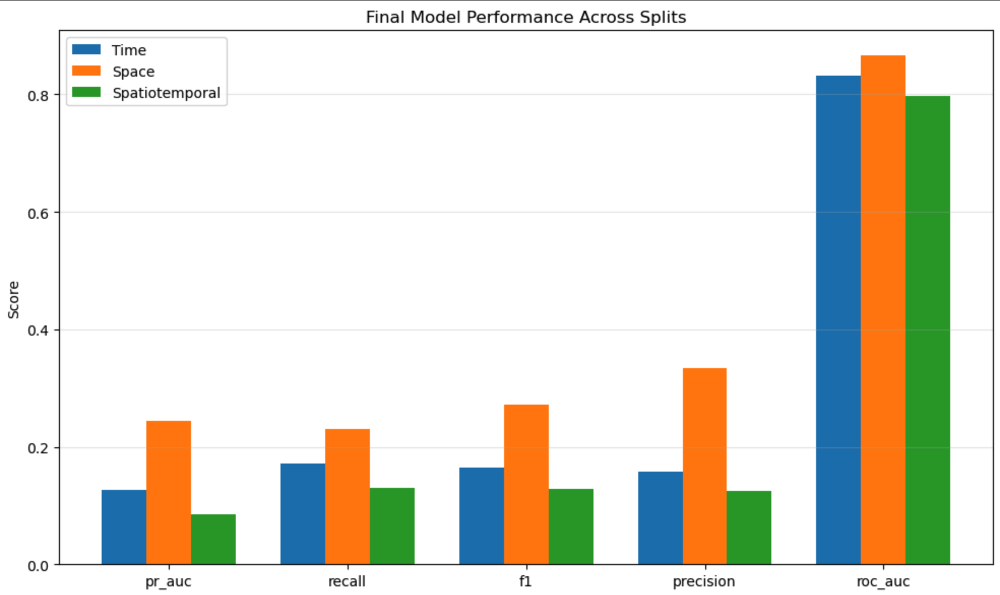

The precision-recall curves show that all models are constrained by class imbalance and low signal, though the space based split provides the most favorable precision–recall trade off. While absolute separability remains limited, the curves indicate that threshold selection can be tuned to prioritize either detection sensitivity or precision, enabling flexible deployment strategies for fire response planning.

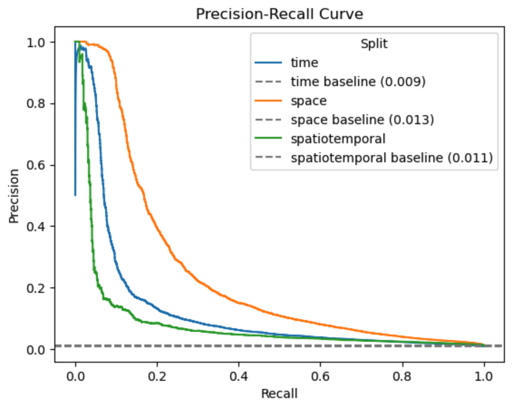

### Feature Importance

The feature importance results indicate a highly skewed predictive structure, with `fire_last_month_binary` (gain of 765) overwhelmingly dominating all other variables (all < 43), suggesting strong temporal persistence in fire occurrence as the primary driver of model predictions. Secondary contributors include seasonality (month), human activity proxies (nighttime lights), vegetation state (NDVI), and spatial location (latitude/longitude), indicating that both environmental context and human influence play meaningful but substantially weaker roles. In contrast, meteorological variables such as wind and precipitation (including 3 month aggregates) show comparatively low importance, suggesting limited incremental predictive value once vegetation and temporal fire history are accounted for. Notably, NDVI change on a logarithmic scale contributes nearly twice the importance of raw NDVI change, implying that relative vegetation dynamics (rather than absolute change) provide a more informative signal for fire risk within the model.

The dominance of `fire_last_month_binary` reflects strong temporal autocorrelation in wildfire occurrence, indicating that recent fire history is the most influential predictor of near-term fire risk within the dataset.

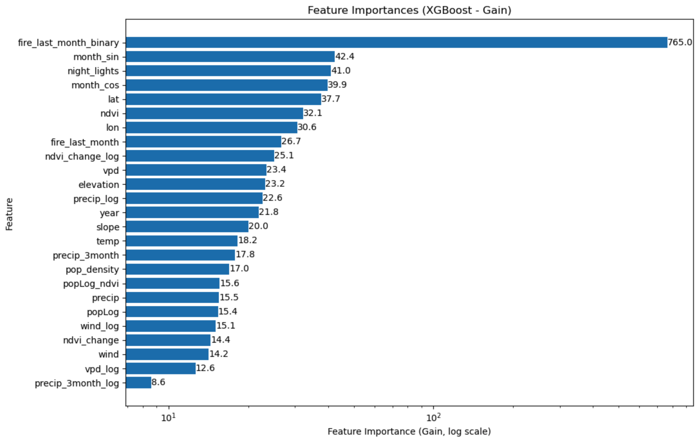

The results indicate a clear seasonal structure in predicted fire risk, with moderately elevated probabilities from March to May followed by a pronounced peak from September through December across all splits. The spring increase likely reflects transitional environmental conditions where warming temperatures and drying fuels begin to raise flammability, while the stronger late year signal suggests a sustained high risk period driven by cumulative drying, vegetation stress, and more persistent fire conducive conditions. Overall, the model appears to capture a bimodal seasonal pattern, with a weaker early season buildup and a dominant late season fire window that is consistently expressed across spatial and temporal training splits.

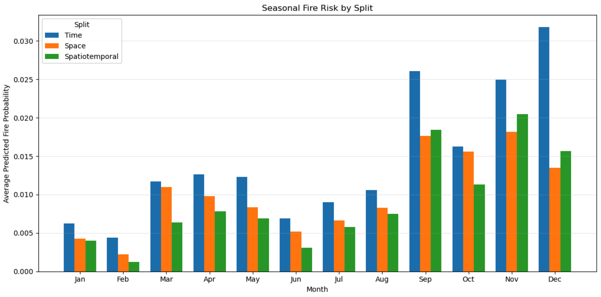

## Findings Summary

Overall, the modeling results indicate that wildfire occurrence exhibits a measurable but limited level of predictability under strong class imbalance, with performance highest in the spatial split and consistently constrained in the spatiotemporal regime. While PR-AUC, precision, and recall remain modest in absolute terms, all models demonstrate clear predictive signal above baseline prevalence. Feature importance and seasonal analysis reveal that wildfire risk is primarily driven by short-term temporal persistence (fire_last_month_binary), reinforced by secondary contributions from seasonality, vegetation conditions, human activity proxies, and spatial location. Meteorological variables contribute comparatively less signal once these dominant factors are accounted for. Collectively, the results suggest that wildfire risk is governed more strongly by persistent temporal and spatial structure than by short term atmospheric variability alone.
